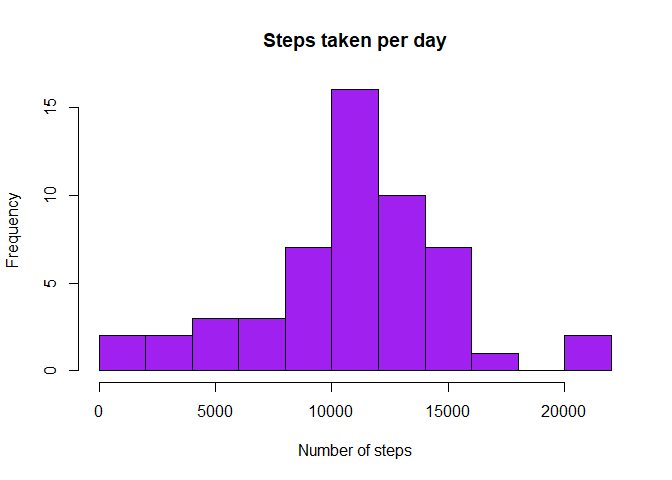
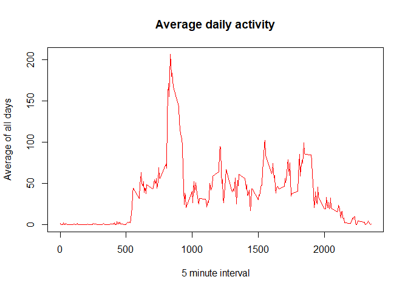
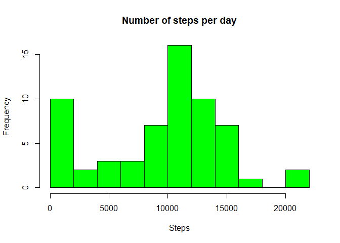
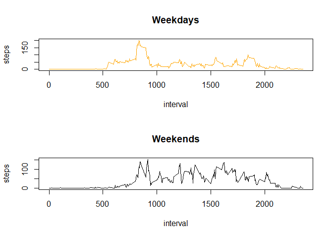

## Loading and preprocessing the data


```r
dataset <- read.csv("activity.csv")
```


## What is mean total number of steps taken per day?


```r
steps <- aggregate(steps ~ date, dataset, sum)

hist(steps$steps, main = "Steps taken per day", xlab = "Number of steps", col = "purple", breaks = 8)
```

<!-- -->


## The mean and the median


```r
Mean <- mean(steps$steps)

print(Mean)
```

```
## [1] 10766.19
```

```r
Median <- median(steps$steps)

print(Median)
```

```
## [1] 10765
```


## What is the average daily activity pattern?


```r
DailyActivity <- aggregate(steps ~ interval, dataset, mean)
plot(DailyActivity$interval, DailyActivity$steps, type = "l", xlab = "5 minute interval", ylab = "Average of all days", main =  "Average daily activity", col = "red")
```

<!-- -->


```r
DailyActivity$interval[which.max(DailyActivity$steps)]
```

```
## [1] 835
```


## Imputing missing values


```r
nrow(dataset[is.na(dataset$steps),])
```

```
## [1] 2304
```


```r
NoNA <- dataset

NoNA[is.na(NoNA$steps), "steps"] <- 0


day <- aggregate(steps ~ date, NoNA, sum)
hist(day$steps, main = "Number of steps per day", xlab = "Steps", col = "green", breaks = 8)
```

<!-- -->

## Mean and Median


```r
newMean <- mean(day$steps)

print(newMean)
```

```
## [1] 9354.23
```

```r
newMedian <- median(day$steps)

print(newMedian)
```

```
## [1] 10395
```

## Are there differences in activity patterns between weekdays and weekends?


```r
NoNA$day <- as.POSIXlt(NoNA$date)$wday

NoNA$type <- as.factor(ifelse(NoNA$day == 0 | NoNA$day == 6, "weekend", "weekday"))

NoNA <- subset(NoNA, select = -c(day))
```


```r
weekday <- NoNA[NoNA$type == "weekday",]
weekend <- NoNA[NoNA$type == "weekend",]

stepsweekdays <- aggregate(steps ~ interval, weekday, mean)
stepsweekends <- aggregate(steps ~ interval, weekend, mean)

par(mfrow = c(2, 1))

plot(stepsweekdays, type = "l", col = "orange", main = "Weekdays")
plot(stepsweekends, type = "l", col = "black", main = "Weekends")
```

<!-- -->
